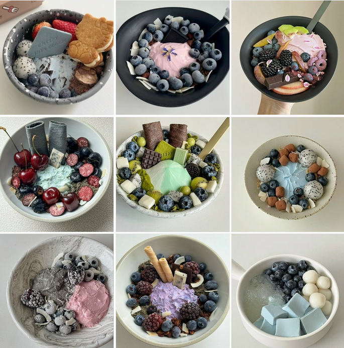

<h1>Нагапетьян Демид Давидович</h1>
<h2>ПИз2302</h2>
 

Это репозиторий лабораторных работ по Разработке мобильных приложений, КУБГАУ.

 

<ul>
  <li><a href="https://github.com/Domest/PI2302_NAGAPETYAN/tree/master/lab1/lab1">Лаб. раб. 1</a></li>
  <li>Лаб. раб. 2 (результатом является данный репозиторий</li>
  <li><a href="https://github.com/Domest/PI2302_NAGAPETYAN/tree/master/lab3">Лаб. раб. 3</a></li>
  <li><a href="https://github.com/Domest/PI2302_NAGAPETYAN/tree/master/lab4">Лаб. раб. 4</a></li>
  <li><a href="https://github.com/Domest/PI2302_NAGAPETYAN/tree/master/lab5">Лаб. раб. 5</a></li>
  <li><a href="https://github.com/Domest/PI2302_NAGAPETYAN/tree/master/lab6">Лаб. раб. 6</a></li>
  <li><a href="https://github.com/Domest/PI2302_NAGAPETYAN/tree/master/lab7">Лаб. раб. 7</a></li>
  <li><a href="https://github.com/Domest/PI2302_NAGAPETYAN/tree/master/lab8">Лаб. раб. 8</a></li>
  <li><a href="https://github.com/Domest/PI2302_NAGAPETYAN/tree/master/lab9-12">Лаб. раб. 9-12</a></li>
</ul>
